# DoCA — PS 26034 Architecture Document
## Legal Metrology (Packaged Commodities) Rules, 2011 Automated Inspection System

> **Architecture Style:** Sovereign, Deterministic, API-first System
> **Target Problem Statement:** PS-26034 (Ministry of Consumer Affairs / Legal Metrology)
> **Key Design Decision:** Zero Cloud LLM Dependency — Local extraction + Deterministic Rules
> **Status:** Backend B1–B8 built and live-verified against Supabase (Sep 2026). Frontend 0% (not scaffolded).

---

## 0. Architectural Principles & Rationales

| Requirement | Traditional Cloud AI Approach | **Our Approach (Chosen)** |
|---|---|---|
| **Field Operational Reality** | Fails in remote mandis, basement godowns, or rural areas without 4G/5G | **Local-first execution** — extraction runs on department/edge infrastructure, never a foreign API |
| **Data Privacy & Sovereignty** | Sends enforcement evidence to third-party cloud endpoints | **Data sovereignty** — Supabase Postgres + private Storage buckets; evidence never leaves the project backend |
| **Operating Cost at Scale** | Recurring per-scan API bills | **₹0 inference cost** — deterministic Python rule engine; small local models on the ML side |
| **Legal Admissibility & Explainability** | Black-box predictions prone to hallucinations | **Deterministic Rule Engine** — every violation maps to Gazette clauses (Rules 5, 6, 7, 8, 9 + First/Second Schedules) |
| **Execution Latency** | 4–8s (upload + queue + tokens) | **Fast verdicts** — rule evaluation is pure Python in-request; report render ~1–2s |

---

## 1. System Technology Stack (as built)

```
                                   DOCA SYSTEM ECOSYSTEM
    ┌─────────────────────────────────────────────────────────────────────────────────┐
    │                                  CLIENT LAYER (proposed, 0% built)              │
    │   • Field Officer App: Flutter *or* responsive PWA officer flow (decision open)  │
    │   • Web Administration Portal: Next.js 15 (App Router) + TypeScript (proposed)   │
    └────────────────────────────────────────┬────────────────────────────────────────┘
                                             │ REST / Multipart Upload (45 routes)
                                             ▼
    ┌─────────────────────────────────────────────────────────────────────────────────┐
    │                               BACKEND API LAYER (BUILT, B1–B8)                   │
    │   • Framework: FastAPI (Python 3.12, Async)                                     │
    │   • Auth: JWT (HS256) + capability RBAC (`require_capability`, SUPERADMIN bypass)│
    │   • Sessions: rotating opaque refresh tokens (sha256, reuse = chain revoked)    │
    │   • ORM: SQLAlchemy 2.0 (Async) + Alembic (baseline + b3/b5/b7, all applied live)│
    │   • Reports: WeasyPrint + Jinja2 (single v1 template, auto-rendered)            │
    └────────────────────────────────────────┬────────────────────────────────────────┘
                                             │ HTTP async-callback (officer JWT)
                                             ▼
    ┌─────────────────────────────────────────────────────────────────────────────────┐
    │                     AI/ML WORKER (partner-owned, contract-integrated)            │
    │   • Geometry & Vision: OpenCV (PDP area, font mm, contrast, clearance)          │
    │   • OCR: bilingual Hindi + English; Tier-1 regex + Tier-2 small local model     │
    │   • Contract: PUTs canonical-key declarations + confidence + geometry (RULEBOOK_ │
    │     CONTRACT.md); backend owns rule comparison, never the worker                │
    └────────────────────────────────────────┬────────────────────────────────────────┘
                                             │ Structured Declarations
                                             ▼
    ┌─────────────────────────────────────────────────────────────────────────────────┐
    │                         DATA & RULE LAYER (BUILT)                               │
    │   • Database: Supabase Postgres (pooler) — relational core + JSONB              │
    │   • Evidence Store: Supabase private buckets (`Bluetick_Image_Store`,           │
    │     `Bluetick_Report_Store`) + presigned URLs; local-disk fallback              │
    │   • Rule Engine: deterministic Python evaluator, locked to rule-set version     │
    │   • Deferred: Redis/Celery (in requirements, not wired — sync suffices today)   │
    └─────────────────────────────────────────────────────────────────────────────────┘
```

---

## 2. End-to-End Inspection Lifecycle (the automation story)

```dot
digraph lifecycle {
    rankdir=LR;
    assign [label="1. Admin assigns\n(checklist)"];
    create [label="2. Officer creates\ninspection\n(rule-set locked)"];
    photo [label="3. Evidence photos\n(FRONT/BACK/SIDE)"];
    analyze [label="4. analyze → QUEUED\n(ML callback)"];
    ingest [label="5. Declarations\ningested + validated"];
    correct [label="6. Officer corrects\n(machine_value kept)"];
    weigh [label="7. Physical sample\nweighed (MPE)"];
    eval [label="8. evaluate →\nPASS/FAIL/REVIEW"];
    report [label="9. PDF auto-rendered\n+ stored"];
    decide [label="10. Admin final\ndecision"];

    assign -> create -> photo -> analyze -> ingest -> correct -> weigh -> eval -> report -> decide;
}
```



Every step writes an `audit_events` row (actor, action, entity, old/new values) — the trail is queryable via `GET /audit-events`.

---

## 3. ML Integration Contract (backend owns the rules, never the extraction)

The worker is a black box behind a strict contract (`docs/RULEBOOK_CONTRACT.md`):

- `POST /inspections/{id}/analyze` → run `QUEUED` (evidence-required guard; reuses an existing queued run).
- Worker `PUT .../analysis-runs/{rid}/declarations` with **canonical keys** (12: `mrp`, `net_quantity`, `net_quantity_unit`, `mfg_date`, `expiry_date`, `generic_name`, `manufacturer_name`, `manufacturer_address`, `packer_name`, `importer_name`, `consumer_care`, `standard_pack_warning`), each with `confidence` 0–1, optional `bounding_box`, `font_size_mm`, `contrast_pass`, `clearance_pass`, `script_language`, `evidence_id` + `raw_ocr_output`. Unknown keys / out-of-range confidence → **422**.
- Run flips `QUEUED → RUNNING → COMPLETED/FAILED` with `ANALYSIS_*` audit rows.
- New model/rule data later = new `rule_sets` row + flip `is_active` — **no code change, history stays locked** to old `rule_set_id`.

---

## 4. Statutory Compliance Engine (100% Deterministic, as built)

Runs in `compliance_service.py` over the versioned rules from **`RULES.md`** (our LM-PCR-2011 extraction; rule-set `LM-PCR-2011-v1.0`).

| Gazette Provision | Check (as built) | Fail condition |
|---|---|---|
| **Rule 6(1)(a) + 10** | Address present with 6-digit PIN (`\b[1-9][0-9]{5}\b`) | Missing address or no valid PIN |
| **Rule 6(1)(b)** | `generic_name` present | Missing |
| **Rule 6(1)(c) + 12 + 13** | Net qty in SI units (`g/kg/ml/l/m/cm/N/U`); bans *approx/minimum/not less than* | Bad unit or misleading term |
| **↳ First Schedule (B8)** | Officer-weighed sample vs declared qty; TABLE-I bands (9%→4.5g→4.5%→9g→3%→15g→1.5%→150g→1%) with statutory rounding; by-number 2% | **Deficiency only** exceeds band (excess is legal); no sample = explicitly not verifiable |
| **↳ Second Schedule / Rule 5 (B8)** | Declared size in the 19-entry standard-size table (biscuits, tea, atta, oils, soaps…) | Non-standard size **without** the *"Not a standard pack size"* disclaimer (`standard_pack_warning`) |
| **Rule 6(1)(d)** | `mfg_date` present | Missing |
| **Rule 6(1)(e)** | MRP carries *"inclusive of all taxes"* legend | Missing MRP or legend |
| **Rule 6(2)** | Consumer-care phone and/or email | Neither found |
| **Rule 7 Table I** | Worker-measured `font_size_mm` vs qty slab (≤200g→1mm, ≤500g→2mm, >500g→4mm, ±0.1mm) | Below minimum |
| **Rule 8(1)** | Worker-measured `clearance_pass` flag | `false` |
| **Rule 9(1)(b)** | Worker-measured `contrast_pass` flag | `false` |
| **Rule 9(4)** | Script allowlist `DEVANAGARI/ENGLISH` across all declarations | Any other script |

**Global invariants (all versions):** low confidence (<0.60) → REVIEW, never FAIL (scoped to each requirement's driving keys) · Rule 3 bulk exemption (>25 kg or industrial notes → Rule 7/8/9(1)(b) NOT_APPLICABLE) · rule-set version lock per inspection · `machine_value` immutable (`final_value = COALESCE(officer_value, machine_value)`).

---

## 5. PostgreSQL Relational Schema with JSONB (as built)

Base DDL below = live tables. Deltas vs this sketch: `refresh_tokens` table (B3: `token_hash` sha256 unique, `expires_at`, `revoked_at`, `replaced_by`); `declarations.final_value` is a SQLAlchemy `hybrid_property` (not a generated column); `requirements.check_logic` carries `{type, …params}` per `RULEBOOK_CONTRACT.md`; KPI/search indexes from migrations `b5_kpi_indexes`, `b7_search_indexes`.

```sql
-- Extensions
CREATE EXTENSION IF NOT EXISTS "uuid-ossp";
CREATE EXTENSION IF NOT EXISTS "pgcrypto";

-- 1. ROLES & USERS (+ refresh_tokens, B3)
CREATE TABLE roles (
    id          UUID PRIMARY KEY DEFAULT gen_random_uuid(),
    name        VARCHAR(50) UNIQUE NOT NULL, -- 'OFFICER', 'REVIEWER', 'ADMIN', 'SUPERADMIN'
    permissions JSONB NOT NULL DEFAULT '{}'  -- capability keys, e.g. can_view_admin_kpis
);

CREATE TABLE users (
    id            UUID PRIMARY KEY DEFAULT gen_random_uuid(),
    role_id       UUID NOT NULL REFERENCES roles(id),
    employee_id   VARCHAR(100) UNIQUE,
    name          VARCHAR(200) NOT NULL,
    email         VARCHAR(200) UNIQUE NOT NULL,
    phone         VARCHAR(20),
    password_hash TEXT NOT NULL,
    is_active     BOOLEAN NOT NULL DEFAULT TRUE,
    created_at    TIMESTAMPTZ NOT NULL DEFAULT now(),
    updated_at    TIMESTAMPTZ NOT NULL DEFAULT now()
);

-- 2. MASTER DATA
CREATE TABLE business_entities (
    id         UUID PRIMARY KEY DEFAULT gen_random_uuid(),
    legal_name VARCHAR(300) NOT NULL,
    type       VARCHAR(50) NOT NULL, -- 'MANUFACTURER', 'PACKER', 'IMPORTER', 'BRAND_OWNER'
    address    TEXT NOT NULL,
    state      VARCHAR(100),
    pincode    VARCHAR(10),
    gstin      VARCHAR(20),
    created_at TIMESTAMPTZ NOT NULL DEFAULT now()
);

CREATE TABLE brands (
    id                 UUID PRIMARY KEY DEFAULT gen_random_uuid(),
    business_entity_id UUID NOT NULL REFERENCES business_entities(id),
    name               VARCHAR(200) NOT NULL,
    created_at         TIMESTAMPTZ NOT NULL DEFAULT now()
);

CREATE TABLE commodities (
    id                 UUID PRIMARY KEY DEFAULT gen_random_uuid(),
    brand_id           UUID REFERENCES brands(id),
    business_entity_id UUID REFERENCES business_entities(id),
    generic_name       VARCHAR(300) NOT NULL,
    category           VARCHAR(100) NOT NULL, -- drives Second Schedule lookup
    barcode            VARCHAR(100) UNIQUE,   -- officer scan-to-identify
    sku                VARCHAR(100),
    package_type       VARCHAR(50) NOT NULL DEFAULT 'BOTTLE_BOX_POUCH',
    standard_pack_size NUMERIC(10,2),
    standard_pack_unit VARCHAR(20),
    created_at         TIMESTAMPTZ NOT NULL DEFAULT now()
);

CREATE TABLE field_definitions (
    id            UUID PRIMARY KEY DEFAULT gen_random_uuid(),
    canonical_key VARCHAR(100) UNIQUE NOT NULL, -- 12 keys (see §3)
    display_name  VARCHAR(200) NOT NULL,
    data_type     VARCHAR(50) NOT NULL, -- 'STRING', 'NUMERIC', 'DATE', 'ADDRESS', 'CONTACT'
    allowed_units JSONB,
    is_mandatory  BOOLEAN NOT NULL DEFAULT TRUE,
    description   TEXT
);

-- 3. RULES (versioned; new version = new row, history never rewritten)
CREATE TABLE rule_sets (
    id           UUID PRIMARY KEY DEFAULT gen_random_uuid(),
    version      VARCHAR(30) UNIQUE NOT NULL, -- 'LM-PCR-2011-v1.0' (active)
    description  TEXT,
    is_active    BOOLEAN NOT NULL DEFAULT FALSE,
    effective_at TIMESTAMPTZ,
    created_at   TIMESTAMPTZ NOT NULL DEFAULT now()
);

CREATE TABLE requirements (
    id            UUID PRIMARY KEY DEFAULT gen_random_uuid(),
    rule_set_id   UUID NOT NULL REFERENCES rule_sets(id),
    rule_ref      VARCHAR(50) NOT NULL, -- 'Rule6(1)(a)', 'Rule7_TableI', …
    title         VARCHAR(200) NOT NULL,
    description   TEXT NOT NULL,
    severity      VARCHAR(20) NOT NULL, -- 'CRITICAL', 'MAJOR', 'MINOR'
    applicable_to JSONB NOT NULL DEFAULT '{}',
    check_logic   JSONB NOT NULL       -- {type: si_unit_compliance | mrp_format | …}
);

-- 4. WORKFLOW: ASSIGNMENTS & INSPECTIONS
CREATE TABLE assignments (
    id           UUID PRIMARY KEY DEFAULT gen_random_uuid(),
    commodity_id UUID NOT NULL REFERENCES commodities(id),
    assigned_by  UUID NOT NULL REFERENCES users(id),
    assigned_to  UUID NOT NULL REFERENCES users(id),
    rule_set_id  UUID NOT NULL REFERENCES rule_sets(id),
    status       VARCHAR(30) NOT NULL DEFAULT 'ASSIGNED', -- ASSIGNED→IN_PROGRESS→COMPLETED, soft CANCELLED
    due_date     DATE,
    notes        TEXT,
    created_at   TIMESTAMPTZ NOT NULL DEFAULT now(),
    updated_at   TIMESTAMPTZ NOT NULL DEFAULT now()
);

CREATE TABLE inspections (
    id                UUID PRIMARY KEY DEFAULT gen_random_uuid(),
    assignment_id     UUID REFERENCES assignments(id),
    commodity_id      UUID NOT NULL REFERENCES commodities(id),
    officer_id        UUID NOT NULL REFERENCES users(id),
    rule_set_id       UUID NOT NULL REFERENCES rule_sets(id), -- locked at creation
    status            VARCHAR(30) NOT NULL DEFAULT 'DRAFT',
    compliance_result VARCHAR(20),  -- 'PASS', 'FAIL', 'REVIEW' (system)
    final_decision    VARCHAR(40),  -- 'APPROVED_COMPLIANT', 'APPROVED_NON_COMPLIANT', 'RETURNED_FOR_REVIEW' (admin)
    location          JSONB,        -- {market_name, district, state} → KPI geo split
    context_notes     TEXT,
    physical_quantity NUMERIC(10,3), -- officer-weighed sample → MPE math
    physical_unit     VARCHAR(20),
    submitted_at      TIMESTAMPTZ,
    finalized_at      TIMESTAMPTZ,
    created_at        TIMESTAMPTZ NOT NULL DEFAULT now(),
    updated_at        TIMESTAMPTZ NOT NULL DEFAULT now()
);

-- 5. EVIDENCE & ANALYSIS RUNS
CREATE TABLE evidence (
    id             UUID PRIMARY KEY DEFAULT gen_random_uuid(),
    inspection_id  UUID NOT NULL REFERENCES inspections(id) ON DELETE CASCADE,
    file_key       TEXT NOT NULL,  -- {inspection_id}/{rand}.{ext} in Bluetick_Image_Store
    file_url       TEXT,           -- presigned GET (1h), refreshed on read
    view_type      VARCHAR(50) NOT NULL, -- 'FRONT_PDP', 'BACK_PANEL', 'SIDE_PANEL', 'CLOSEUP'
    mime_type      VARCHAR(100) NOT NULL, -- jpg/png/webp ≤10MB (validated)
    pdp_area_cm2   NUMERIC(8,2),
    image_metadata JSONB,           -- {width, height, dpi, blur_score}
    uploaded_at    TIMESTAMPTZ NOT NULL DEFAULT now()
);

CREATE TABLE analysis_runs (
    id               UUID PRIMARY KEY DEFAULT gen_random_uuid(),
    inspection_id    UUID NOT NULL REFERENCES inspections(id) ON DELETE CASCADE,
    pipeline_version VARCHAR(50) NOT NULL,
    model_version    VARCHAR(50) NOT NULL,
    status           VARCHAR(30) NOT NULL DEFAULT 'QUEUED', -- QUEUED→RUNNING→COMPLETED/FAILED
    started_at       TIMESTAMPTZ,
    completed_at     TIMESTAMPTZ,
    error_detail     TEXT,
    raw_ocr_output   JSONB,
    created_at       TIMESTAMPTZ NOT NULL DEFAULT now()
);

-- 6. DECLARATIONS (machine vs officer dual-value)
CREATE TABLE declarations (
    id                  UUID PRIMARY KEY DEFAULT gen_random_uuid(),
    inspection_id       UUID NOT NULL REFERENCES inspections(id) ON DELETE CASCADE,
    analysis_run_id     UUID REFERENCES analysis_runs(id),
    evidence_id         UUID REFERENCES evidence(id),
    field_definition_id UUID NOT NULL REFERENCES field_definitions(id),
    machine_value       TEXT,  -- immutable worker output
    officer_value       TEXT,  -- officer correction (final_value = COALESCE)
    confidence          NUMERIC(5,4) CHECK (confidence BETWEEN 0 AND 1),
    confidence_label    VARCHAR(20), -- 'HIGH', 'MEDIUM', 'LOW', 'UNDETECTED'
    bounding_box        JSONB,
    font_size_mm        NUMERIC(5,2),  -- → Rule 7
    contrast_pass       BOOLEAN,       -- → Rule 9(1)(b)
    script_language     VARCHAR(50),   -- → Rule 9(4)
    clearance_pass      BOOLEAN,       -- → Rule 8(1)
    is_corrected        BOOLEAN NOT NULL DEFAULT FALSE,
    correction_reason   TEXT,
    created_at          TIMESTAMPTZ NOT NULL DEFAULT now(),
    updated_at          TIMESTAMPTZ NOT NULL DEFAULT now()
);

-- 7. EVALUATIONS & FINDINGS
CREATE TABLE compliance_evaluations (
    id             UUID PRIMARY KEY DEFAULT gen_random_uuid(),
    inspection_id  UUID NOT NULL REFERENCES inspections(id) ON DELETE CASCADE,
    requirement_id UUID NOT NULL REFERENCES requirements(id),
    result         VARCHAR(20) NOT NULL, -- 'PASS', 'FAIL', 'REVIEW', 'NOT_APPLICABLE'
    evaluated_at   TIMESTAMPTZ NOT NULL DEFAULT now(),
    eval_detail    JSONB -- {explanation, detail: {mpe: {…}, pack_size: {…}}}
);

CREATE TABLE findings (
    id                       UUID PRIMARY KEY DEFAULT gen_random_uuid(),
    inspection_id            UUID NOT NULL REFERENCES inspections(id) ON DELETE CASCADE,
    compliance_evaluation_id UUID NOT NULL REFERENCES compliance_evaluations(id),
    evidence_id              UUID REFERENCES evidence(id),
    severity                 VARCHAR(20) NOT NULL,
    title                    VARCHAR(300) NOT NULL,
    explanation              TEXT NOT NULL,
    legal_reference          VARCHAR(100) NOT NULL, -- e.g. 'Rule6(1)(c); First Schedule Table-I'
    officer_accepted         BOOLEAN,               -- NULL = pending review
    officer_note             TEXT,
    created_at               TIMESTAMPTZ NOT NULL DEFAULT now()
);

-- 8. REPORTS & AUDIT TRAIL
CREATE TABLE reports (
    id            UUID PRIMARY KEY DEFAULT gen_random_uuid(),
    inspection_id UUID UNIQUE NOT NULL REFERENCES inspections(id),
    file_key      TEXT NOT NULL, -- reports/{inspection_id}.pdf in Bluetick_Report_Store
    file_url      TEXT,          -- fresh presigned URL minted on every read
    report_format VARCHAR(20) NOT NULL DEFAULT 'PDF',
    generated_at  TIMESTAMPTZ NOT NULL DEFAULT now(),
    generated_by  UUID NOT NULL REFERENCES users(id)
);

CREATE TABLE audit_events (
    id          UUID PRIMARY KEY DEFAULT gen_random_uuid(),
    actor_id    UUID NOT NULL REFERENCES users(id),
    action      VARCHAR(100) NOT NULL, -- INSPECTION_CREATED, COMPLIANCE_EVALUATED, REPORT_GENERATED, …
    entity_type VARCHAR(100) NOT NULL,
    entity_id   UUID NOT NULL,
    old_value   JSONB,
    new_value   JSONB,
    reason      TEXT,
    created_at  TIMESTAMPTZ NOT NULL DEFAULT now()
);

CREATE INDEX idx_audit_entity_time ON audit_events(entity_type, entity_id, created_at DESC);
CREATE INDEX idx_declarations_insp ON declarations(inspection_id);
CREATE INDEX idx_findings_insp     ON findings(inspection_id);
-- + b5_kpi_indexes (dashboard aggregations) and b7_search_indexes (repository facets)
```

---

## 6. Report Generation Engine (as built, B6)

Reports are **deterministic PDFs** rendered server-side — the frontend only streams bytes:

- **Single v1 template** (`inspection_report.html.j2`, 8 sections: header + IDs, particulars, commodity/parties, evidence thumbnails, declarations machine-vs-officer, per-requirement results, findings, outcome + sign-off). Our own prototype layout — *not* the Gazette Seventh Schedule Forms A/B (those arrive as a second template later; code is structured for it).
- **Auto-rendered inside every `evaluate`** (re-evaluate regenerates; failure never blocks the verdict; `GET .../report` lazy-generates if missing). `REPORT_GENERATED` audit per render.
- Stored as `reports/{inspection_id}.pdf` in **`Bluetick_Report_Store`**; `GET .../report` mints a **fresh presigned URL on every read**. RBAC: `can_view_own_reports` (own) / `can_view_all_reports` (admin).
- Evidence photos embedded as base64 thumbnails (fetched server-side with the service key).

---

## 7. API Surface (45 routes, all live-verified)

| Domain | Routes | Guards |
|---|---|---|
| Auth + users | login (form/json), me, refresh rotation, logout, users CRUD | `can_manage_users`; refresh reuse kills the chain |
| Assignments | allocate/list/reassign/cancel, my-checklist, officer transitions | `can_assign`; ASSIGNED→IN_PROGRESS→COMPLETED enforced |
| Master data | entities/brands/commodities CRUD, nested lists, barcode search | officer read-only, `can_manage_master_data` write |
| Inspections | create/get/list/patch/submit/review/decision | ownership scoping throughout |
| Evidence + ML | upload, analyze, poll run, declarations ingest, correct declaration | officer JWT; strict 422 validation |
| Compliance | evaluate (auto-report), findings, accept/note finding | — |
| Dashboards | officer (today/pending/rate/recent), admin KPIs (trend, compliance, recidivism, AI quality, workload, geo, sectors) | `can_view_admin_kpis` |
| Reports | GET (lazy) + POST re-render per inspection | own/all reports split |
| Repository | faceted search + CSV export | auto-scoped to own |
| Audit + rules | audit-events query, rule-sets list/active/detail | `can_view_audit` |

---

## 8. Build Status (backend)

| Step | Scope | Status |
|---|---|---|
| B1 | Evidence upload → Supabase Storage + presigned GETs | ✅ live |
| B2 | ML async-callback contract + applicability + REVIEW invariants | ✅ live |
| B3 | Capability RBAC + users CRUD + refresh rotation + rulebook docs | ✅ live |
| B4 | Assignments + master-data CRUD + barcode search + officer dashboard | ✅ live |
| B5 | Admin KPI aggregation + indexes | ✅ live |
| B6 | Auto-generated inspection PDF report + report bucket | ✅ live |
| B7 | Repository search + CSV export + audit-trail query | ✅ live |
| B8 | First Schedule MPE + Second Schedule pack-size validators | ✅ live |

**Deferred by design:** second report template (official Forms) · Excel export · pg_trgm search · Celery background rendering · model-partner pipeline + rule v2 drop-in.
