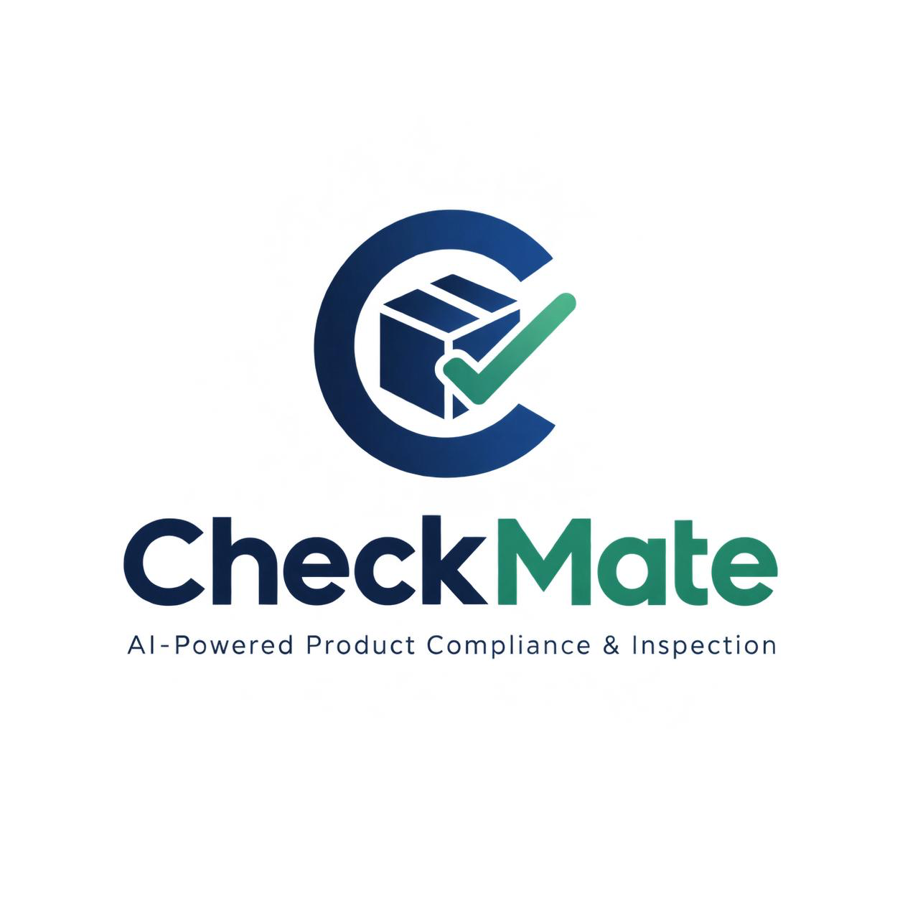
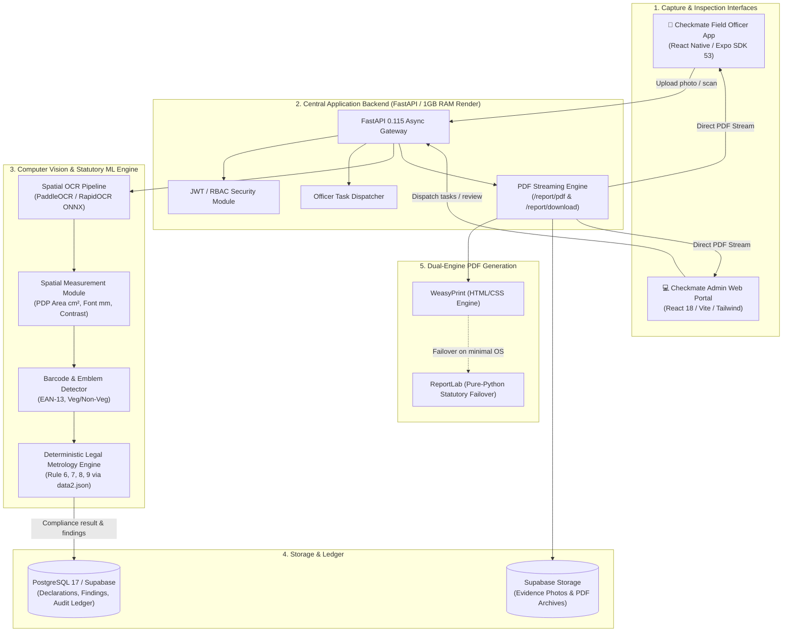
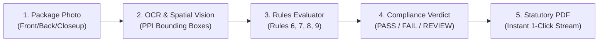

# ♟️ Checkmate — Autonomous Legal Metrology & Statutory Compliance System

<div align="center">



### *Next-Generation Edge-to-Cloud Statutory Compliance & Spatial Vision Intelligence Platform*
*Built for the Department of Consumer Affairs (DoCA), Government of India*

[](https://www.python.org/)
[](https://fastapi.tiangolo.com/)
[](https://expo.dev/)
[](https://vitejs.dev/)
[](https://tailwindcss.com/)
[](https://www.postgresql.org/)
[](LICENSE)

[Architecture](#-system-architecture) • [Core Pipeline](#-core-compliance-pipeline) • [Features](#-key-features) • [Mobile App](#-field-officer-mobile-app) • [Admin Portal](#-department-admin-web-portal) • [Quickstart](#-quickstart--local-development) • [Deployment](#-deployment-guide)

</div>

---

## 📌 Executive Overview

In India's fast-moving retail and e-commerce ecosystems, millions of pre-packaged commodities enter the market daily. Ensuring strict adherence to the **Legal Metrology Act, 2009** and the **Legal Metrology (Packaged Commodities) Rules, 2011** is critical to protecting consumers from deceptive packaging, font illegibility, incorrect MRP declarations, and net quantity deficiencies.

**Checkmate** is a production-grade, end-to-end statutory compliance intelligence system designed for Department of Consumer Affairs (DoCA) officers and administrators. It replaces manual, error-prone field inspections with:
1. **Automated Spatial Vision & OCR**: Precision optical measurement of package font heights in millimeters relative to the Principal Display Panel (PDP), contrast ratios, EAN-13 barcodes, and Veg/Non-Veg emblems.
2. **Deterministic Rules Engine (`data2.json`)**: Real-time statutory auditing under **Rules 6, 7, 8, and 9** of the Packaged Commodities Rules.
3. **Statutory PDF Report Generation**: Instant inline streaming (`/report/pdf`) and 1-click download (`/report/download`) with dual-engine failover (**WeasyPrint + ReportLab**).
4. **Field Officer Mobile App**: Streamlined 2-tab mobile interface (Expo / React Native) with 1-tap inspection launch from assigned commodities.
5. **Department Admin Web Portal**: Real-time officer task dispatch, commodity registry, live audit findings, and embedded statutory PDF viewer.

---

## 🏛️ System Architecture



---

## 🔬 Core Compliance Pipeline



### 1. Mandatory Declarations Audit (Rule 6)
Verifies the presence and validity of statutory declarations:
- **Rule 6(1)(a)**: Name and address of the manufacturer, packer, or importer.
- **Rule 6(1)(b)**: Generic or common name of the commodity contained in the package.
- **Rule 6(1)(c)**: Net quantity in terms of standard unit of weight or measure.
- **Rule 6(1)(d)**: Month and year of manufacture, packing, or import.
- **Rule 6(1)(da)**: Maximum Retail Price (MRP) inclusive of all taxes, with mandatory unit sale price (USP).
- **Rule 6(1)(n)**: Consumer Care details (Name, Address, Telephone, Email).

### 2. Optical Font Size Verification (Rule 7 & Table 1)
Under statutory law, font height cannot be arbitrary; it is strictly bounded by the area of the **Principal Display Panel (PDP)**:
- $\text{PDP Area} \le 50\,\text{cm}^2 \implies \text{Min Font Height } 1.0\,\text{mm}$ (or $1.5\,\text{mm}$ for blown/molded containers)
- $50\,\text{cm}^2 < \text{PDP Area} \le 100\,\text{cm}^2 \implies \text{Min Font Height } 1.5\,\text{mm}$
- $100\,\text{cm}^2 < \text{PDP Area} \le 500\,\text{cm}^2 \implies \text{Min Font Height } 2.0\,\text{mm}$
- $500\,\text{cm}^2 < \text{PDP Area} \le 2500\,\text{cm}^2 \implies \text{Min Font Height } 4.0\,\text{mm}$
- $\text{PDP Area} > 2500\,\text{cm}^2 \implies \text{Min Font Height } 6.0\,\text{mm}$

Checkmate uses pixel-density calibration and spatial contour analysis to measure real-world font height and flag sub-millimeter violations.

### 3. Contrast & Legibility Check (Rule 8)
Calculates the photometric luminance ratio between declaration typography and package background. If contrast falls below statutory legibility thresholds, a violation is recorded.

---

## ✨ Key Features

| Feature | Description |
|---|---|
| **Ultra-Lightweight Backend** | Optimized async connection pooling (max 8 connections) and headless libraries designed to operate comfortably within a **1GB RAM budget on Render**. |
| **Zero-C-Dependency PDF Failover** | Dual PDF engine: utilizes WeasyPrint when system C-libraries are present, and seamlessly falls back to pure-Python **ReportLab** to ensure 100% PDF uptime on any container. |
| **Native Direct PDF Streaming** | Native streaming via `/report/pdf` (inline view) and `/report/download` (attachment) eliminates expired pre-signed URLs, browser pop-up blockers, and CORS issues. |
| **Standalone ML Microservice** | Decoupled microservice (`doca-ml-service`) with PaddleOCR & RapidOCR ONNX fallback, ready for free hosting on **Hugging Face Spaces (16GB RAM)**. |
| **Task Assignment & Dispatch** | Admins can dispatch commodities directly to field officers with target inspection dates and audit directives from the top navigation bar. |
| **Streamlined Field Experience** | Mobile app organized into a 2-tab layout: **"Assigned to Me"** with 1-tap inspection pre-load, and **"Completed History"** with 1-tap statutory PDF certificates. |

---

## 📱 Field Officer Mobile App

The Checkmate Field Officer App is built with **Expo SDK 53** and **React Native**, designed for low-connectivity field audits:
- **Pending Task Alerts**: Real-time home dashboard alert banner notifying officers of newly assigned commodities.
- **One-Tap Inspection Launcher**: Officers tap **"Start Inspection"** on an assigned task; metadata (Brand, Category, SKU, Standard Pack Size) is pre-loaded into the camera scanner.
- **Offline-First Resilience**: Local Zustand store caches inspection progress and photographic evidence.
- **In-App Statutory PDF Inspection**: Instant preview of official compliance certificates directly on mobile devices.

```
DoCA/frontend_app/
├── app/
│   ├── (tabs)/
│   │   ├── index.tsx          # Officer Dashboard with live metrics & assignment alerts
│   │   ├── inspections.tsx    # 2-Tab View: "Assigned to Me" & "Completed History"
│   │   └── dashboard.tsx      # 7-Day compliance volume trends & analytics
│   ├── scanner.tsx            # Camera view with bounding box overlays
│   └── analysis/[id].tsx      # Detailed declaration audit & 1-click PDF certificate
└── src/
    ├── api/doca.ts            # Centralized API client & streaming endpoints
    ├── store/inspectStore.ts  # Inspection workflow state machine
    └── theme/colors.ts        # Checkmate Deep Teal & Amber design palette
```

---

## 💻 Department Admin Web Portal

The Checkmate Admin Portal is built with **React 18**, **Vite 6**, and **Tailwind CSS**:
- **Executive Oversight**: Real-time stats on total inspections, compliance pass/fail ratios, and risk scores across commodities and brands.
- **Global "Assign Task" Action**: Dispatches commodities to field officers across districts with one click from any screen.
- **Embedded Statutory PDF Modal**: Full-screen inline PDF certificate viewer with direct download and new-tab controls.
- **Auditing & History**: Complete immutable audit trail capturing every officer action, machine extraction, and rule evaluation.

```
DoCA/frontend_admin/
├── src/
│   ├── components/
│   │   ├── Header.tsx                 # Brand bar with global "Assign Task" button
│   │   ├── InspectionDetailView.tsx   # Detailed findings table + PDF modal
│   │   ├── InspectionsPage.tsx        # Filterable inspection ledger
│   │   ├── ReportsPage.tsx            # Statutory reports directory with streaming links
│   │   └── AssignCommodityModal.tsx   # Officer task assignment modal
│   └── api/client.ts                  # Axios client with auto-token refresh & environment config
```

---

## 📁 Repository Structure

```
.
├── backend/                           # Central FastAPI Backend
│   ├── app/
│   │   ├── api/v1/                    # REST routes (inspections, reports, assignments)
│   │   ├── core/                      # Config, JWT auth, and database settings
│   │   ├── db/                        # SQLAlchemy async engine & seed scripts
│   │   ├── models/                    # Database models (declarations, findings, inspections)
│   │   ├── schemas/                   # Pydantic validation schemas
│   │   └── services/                  # OCR, compliance evaluator & dual PDF generators
│   ├── requirements.txt               # Lightweight production dependencies
│   └── tests/                         # Automated unit & compliance test suite
│
├── doca-ml-service/                   # Standalone Legal Metrology ML Microservice
│   ├── engine/                        # Vision, OCR, parser & rules engine modules
│   ├── config/data2.json              # Statutory Legal Metrology rules definitions
│   ├── main.py                        # FastAPI microservice endpoints (/health, /predict, /inspect)
│   ├── Dockerfile                     # Pre-warmed OCR cache container
│   └── DEPLOYMENT_GUIDE.md            # Guide for Hugging Face Spaces & Render
│
├── frontend_admin/                    # Department Admin Web Portal (Vite + React TS)
├── frontend_app/                      # Field Officer Mobile Application (Expo SDK 53)
├── Dockerfile                         # Production Dockerfile for Backend
├── docker-compose.yml                 # Local development stack (Postgres, Redis, MinIO)
└── render.yaml                        # Render blueprint (1GB Starter Tier)
```

---

## 🚀 Quickstart & Local Development

### Prerequisites
- **Python 3.11 or 3.12**
- **Node.js 18+** & **npm**
- **Docker & Docker Compose** (optional, for local DB)

---

### 1. Backend Setup
```bash
cd backend

# Create and activate virtual environment
python3 -m venv venv
source venv/bin/activate

# Install dependencies
pip install -r requirements.txt

# Run database migrations
alembic upgrade head

# Start development server
uvicorn app.main:app --host 0.0.0.0 --port 8000 --reload
```
API Documentation will be available at `http://localhost:8000/api/v1/docs`.

---

### 2. Standalone ML Microservice Setup
```bash
cd doca-ml-service

# Create virtual environment & install dependencies
python3 -m venv venv
source venv/bin/activate
pip install -r requirements.txt

# Start ML microservice on port 7860
uvicorn main:app --host 0.0.0.0 --port 7860 --reload
```
Swagger UI available at `http://localhost:7860/docs`.

---

### 3. Admin Web Portal Setup
```bash
cd frontend_admin

# Install dependencies
npm install

# Start development server
npm run dev
```
Portal will be live at `http://localhost:5173`.

---

### 4. Field Officer Mobile App Setup
```bash
cd frontend_app

# Install dependencies
npm install

# Start Expo development server
npx expo start
```
Scan the QR code with Expo Go (Android/iOS) or press `w` to run in web browser.

---

## 🌐 Deployment Guide

### Deploy ML Service to Hugging Face Spaces (Free 16GB RAM)
1. Create a new Space at [huggingface.co/new-space](https://huggingface.co/new-space).
2. Select **Docker** -> **Blank** with **CPU Basic (2 vCPU · 16 GB RAM · Free)**.
3. Push the `doca-ml-service` directory:
   ```bash
   cd doca-ml-service
   git init && git checkout -b main
   git remote add hf https://huggingface.co/spaces/<USERNAME>/<SPACE_NAME>
   git add . && git commit -m "Deploy Checkmate ML Engine"
   git push -u hf main --force
   ```
4. Space will be accessible at: `https://<USERNAME>-<SPACE_NAME>.hf.space`.

---

### Deploy Backend to Render (1GB Starter Tier)
1. Link your GitHub repository to [dashboard.render.com](https://dashboard.render.com).
2. Create a **Web Service** with the following settings:
   - **Environment**: Docker
   - **Dockerfile Path**: `./Dockerfile`
   - **Plan**: Starter (1GB RAM)
   - **Health Check Path**: `/health`
3. Configure Environment Variables:
   - `DATABASE_URL`: Supabase PostgreSQL pooler connection string.
   - `SUPABASE_URL`: Supabase project URL.
   - `SUPABASE_SERVICE_KEY`: Supabase service role key.
   - `SECRET_KEY`: Random 64-character secret.
   - `ML_SERVICE_URL`: Your Hugging Face Space URL (or leave blank to use built-in RapidOCR).

---

## 🧪 Testing & Verification

Run the automated test suite in `backend/`:
```bash
cd backend
python3 -m pytest tests/test_pdf_and_compliance.py -v
```

Typecheck the mobile application:
```bash
cd frontend_app
npx tsc --noEmit
```

Build the admin web portal for production:
```bash
cd frontend_admin
npm run build
```

---

## ⚖️ Statutory Legal Metrology Reference

Checkmate encodes the statutory provisions of the **Legal Metrology (Packaged Commodities) Rules, 2011**:

| Rule | Title | Statutory Requirement |
|---|---|---|
| **Rule 6(1)(a)** | Manufacturer Identification | Name & complete physical address of manufacturer, packer, or importer. |
| **Rule 6(1)(b)** | Commodity Identity | Generic or common name of the commodity contained in the package. |
| **Rule 6(1)(c)** | Net Quantity | Standard units ($g, kg, mL, L$). Units must adhere to SI metric standard. |
| **Rule 6(1)(d)** | Date of Manufacture | Month and Year of manufacture / packaging / import in prescribed format. |
| **Rule 6(1)(da)** | Retail Sale Price (MRP) | "MRP ₹ ... incl. of all taxes" + Unit Sale Price (USP) per gram/ml. |
| **Rule 6(1)(n)** | Consumer Care | Name, address, phone number, and email for consumer grievance redressal. |
| **Rule 7** | Font Size Standards | Optical font height proportional to package Principal Display Panel (PDP) area. |
| **Rule 8** | Legibility & Contrast | High luminance contrast between text and background. |
| **Rule 9** | Display Placement | Mandatory declarations positioned clearly on the Principal Display Panel. |

---

<div align="center">

**Developed with precision for the Department of Consumer Affairs, Government of India.**  
*Checkmate — Empowering Officers, Protecting Consumers.*

</div>
